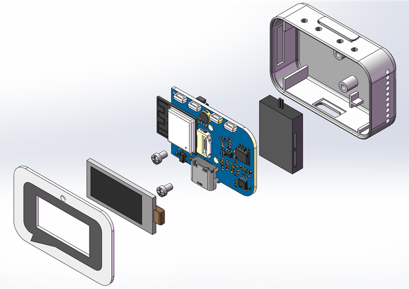
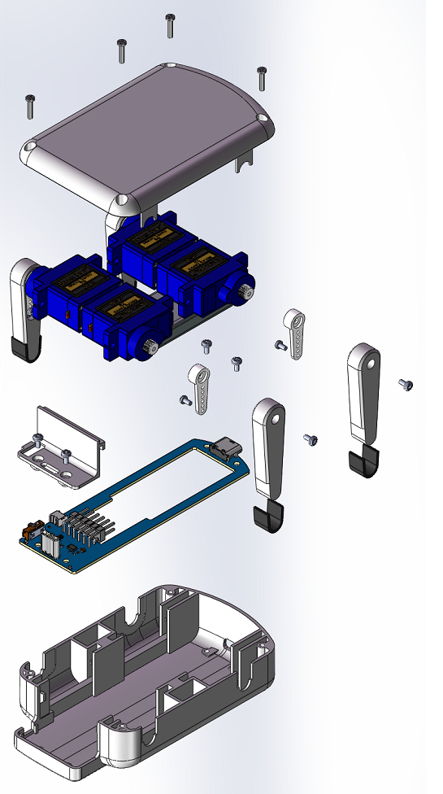

# ESP-Hi: ESP32-C3 超低成本 AI 对话机器狗

## 项目简介
ESP-Hi 是一款基于 ESP32-C3 的 **超低成本 AI 对话机器狗**。通过接入大语言模型（如小智AI），可以实现智能对话功能；内置水银开关可以感知晃动，实现唤醒和动作控制；集成了一个0.96寸的彩屏，用于显示表情，机器狗已实现十数种动作。通过对 ESP32-C3 外设的充分挖掘，仅需最少的板级硬件即可实现拾音和发声，同步优化了软件，降低内存与 Flash 占用，在资源受限的情况下同时实现了**唤醒词检测**与多种外设驱动。

## 视频展示

[超低成本也能体验大模型交互！ESP32-C3 AI 机器人](https://www.bilibili.com/video/BV1BHJtz6E2S/)

## 硬件设计

硬件已开源在立创平台：[ESP-Hi](https://oshwhub.com/esp-college/esp-hi)

## 软件资源

视频中演示的工程已合入 [xiaozhi-esp32](https://github.com/78/xiaozhi-esp32) 仓库

目前已开放部分代码例程，请参考 [example 文件夹](example)，后续会持续升级更新

## 3D 结构设计

- 3D 打印文件已[开放附件](3D_Print)，欢迎下载！

- **本体结构**

    ESP-Hi 本体采用层叠式设计，本体由一块 ESP-Hi MainBoard PCB（板厚为 1.2mm）、两个 3D 打印结构件（一个外壳、一个遮光消噪结构件）、一块正面亚克力面板（厚度为 1mm）组成。：

    

    
    

- **机器狗子板结构**

    机器狗子板由一块 ServoDogBoard PCB 板、4 个 3D 打印零件、一块 702040 500mAh 锂离子电池、4 个 180 度 SG92R 舵机组成，3D 结构爆炸视图如下：

    

    
    

